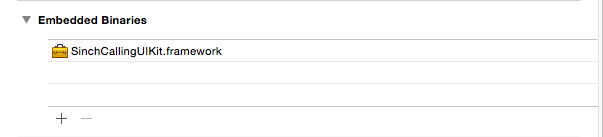
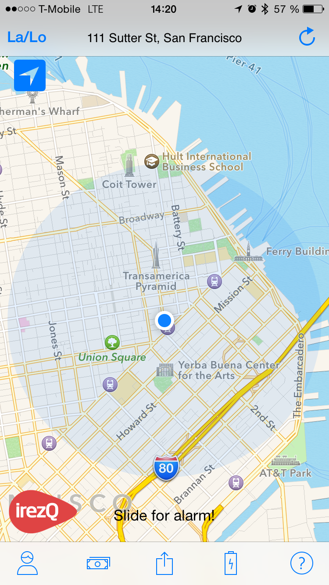
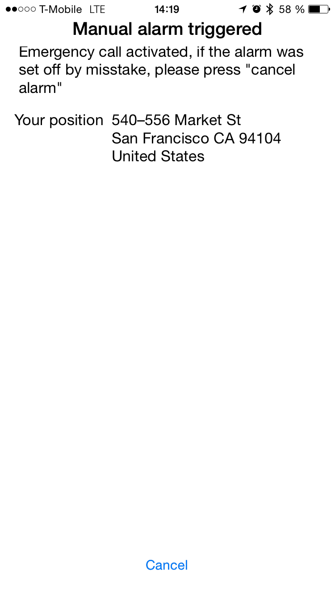
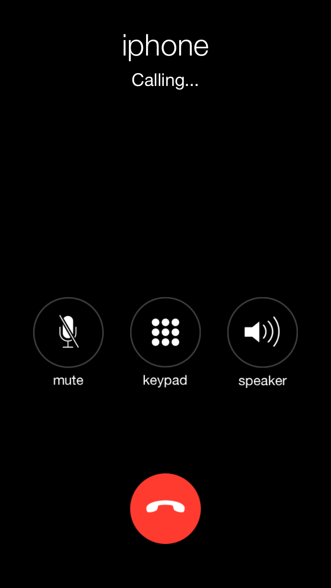
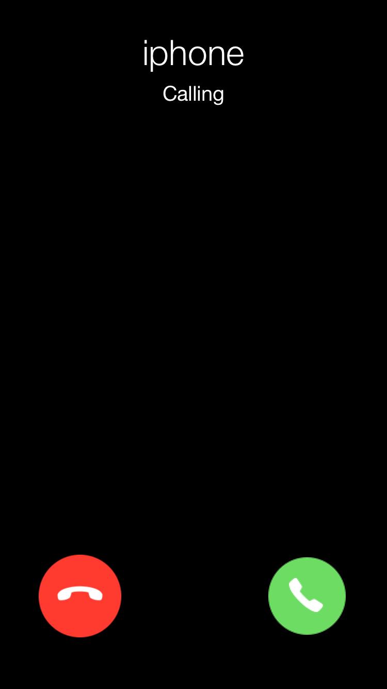
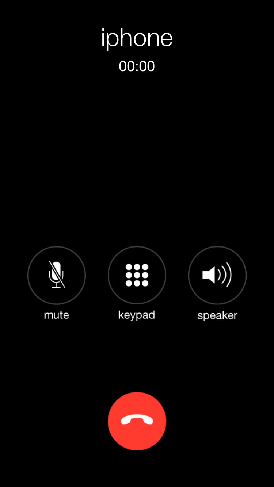

# Add calling to your existing app in two minutes
if you are like me and want to prototype fast and a/b test fast you are going to love this. I made a small iOS framework that takes care of all the delegates and ui to add calling to your app in just 4 lines of code. 

So I have a minor investment in a company called iRezQ and I wanted to try out if VoIP calling could help them save some money and add an extra feature on top of the existing functionality. 

iRezQ is an app that warns you about traffic accidents around you, it detects traffic accidents by using your accelerometer with a algoritm that they developed with some insurance companies. But plugging iRezQ.

## Setup 
I Downloaded the framework [here](https://www.dropbox.com/s/462krss0k4ov8x3/SinchCallingUIKit.tar.gz?dl=0) or check out the the github repo [https://github.com/sinch/SinchCallingUIKit]()
First I drop it as an embedded binary in my project (don't forget to check that freaking copy if needed box)



Second I add the **other linker flags** `-ObjC -Xlinker -lc++` in my targets build settings.
The last thing in setup I need to add the required frameworks by sinch, AudioToolbox, AVFoundation and Security.framework. 
(Hey, if you like this kit, I can make available as an pod so you don't even have to the above steps.)

## Initializing Sinch at the right time. 
The next thing I need to do is to initialize the SinchCallingUIKit, in my project I need to do that in two places, on app launch if its not the first launch or right after account creation or login. In this app thats in AppDelegate and a VerifyCode controller. 

```objectivec
- (BOOL)application:(UIApplication *)application didFinishLaunchingWithOptions:(NSDictionary *)launchOptions {
	// removed alot of code for clarity ;)
    [[CallingManager sharedManager]
     startClientWithKey:@"mykey"
     secret:@"mysecret"
     userName:[User currentUser] sandbox:YES
     launchOptions:launchOptions];
    return YES;
}
```
The [User currentUser] is an internal object to iRezQ where I keep the user info about the currently logged in user. 

I added the same line of code to my controller where I verify the user. 

## Adding a call 
In iRezQ there is a premium feature where you can call and ask for help, right now the app is sending an alert to the operator that they should call them. 

I remove that code and add the import to my controller and the following line of code
```objectivec
[[CallingManager sharedManager] callNumber:@"irezQAlarmnumber"];
```

Thats it, now I am ready to show this to the product owner, in just a few minutes. And its good to submit to the app store. We probably wont do it, because we want to have VoIP calling so we can send som extra headers with more meta information about the call. But in just a few minutes we can try out the user flow and potential UI without having to plan a whole sprint. The flow is you drag the manual alarm button on the screen and that will trigger the second screen and after a time out a phone call will be made. 

<table>
<tr>
<td>
 
</td>
<td>
 
</td>

<td>
 
</td>
<td>

</td>
<td>

</tr>
</table>

We are really interested to know how you feel about these kind of libraries, tweet me a @cjsinch or mail me at christian@sinch.com. and if there is interest we could put in some more effort in to these and maybe have it as a supported product feature. For now enjoy the open source framework that lets you add calling in 3 minutes.


